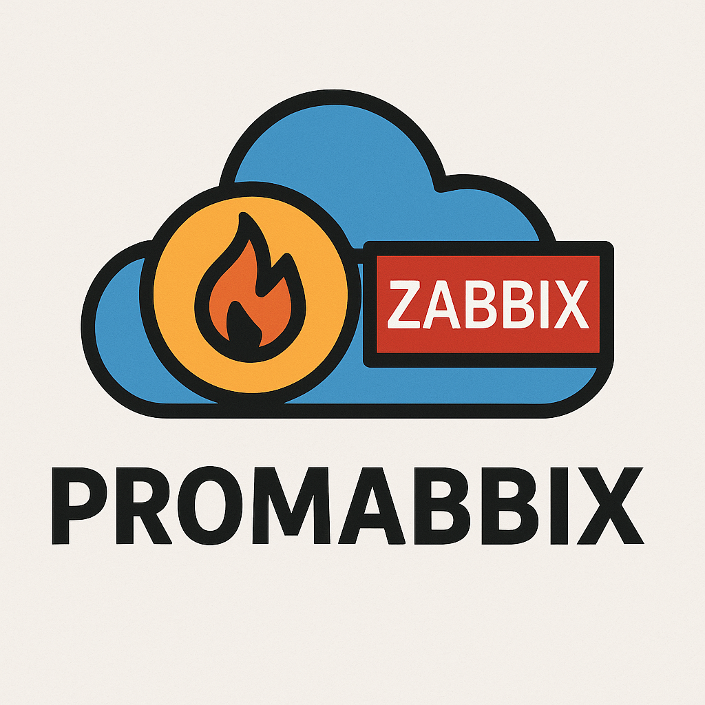
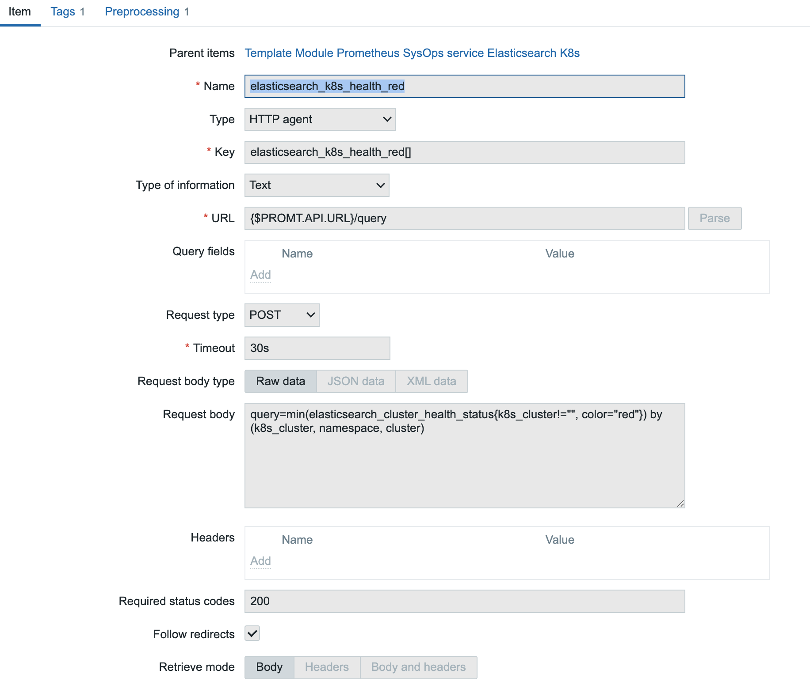

# Promabbix

Connecting Prometheus to Zabbix.



## TL;DR

This tooling allows you to keep you favourite monitoring tool Zabbix and have a production-ready integration with Prometheus in a way similar to AlertManager. It consists of 2 parts:

* Script to generate Zabbix Template from AlertManager-like definitions of Prometheus metrics
* GitOps tooling allowing you to manage the vast majority of your Zabbix installation in a Infrastructure-as-a-Code (IaaC) pattern (To-be-done)

## Usage

```bash
# build an image
docker buildx build -t promabbix:local .
# or you can use image from DockerHub:
# docker pull promabbix/promabbix

# get help
docker run promabbix:local

# read data from STDIN and output on STDOUT
cat examples/minikube-alert-config.yaml | docker run -i promabbix:local - -o -

# run with a mounted directory and retrieve the result file from there
docker run --mount type=bind,src=$(pwd)/examples/,dst=/mnt promabbix:local /mnt/minikube-alert-config.yaml -o /mnt/minikube-alert-generated-template.json
```

## Prometheus (VictoriaMetrics) to Zabbix Integration (simplified version of docs to understand the gist)

Our monitoring stack combines the Prometheus metrics with Zabbix in the following way:
* zabbix-agents run on VMs and provide OS-level monitoring (mostly)
* Prometheus scrapes Kubernetes clusters and other dynamic environments
  * (End-result is that all metrics are sent to a single large VictoriaMetrics instance)
* we want all alerting and evaluation to be done in a single point that is Zabbix
* alerts are pushed to Slack and PagerDuty

Given these technologies have incompatible data model, we've come up with a following process on how to combine them:

* You define `PromQL` queries for your alerts (could be mostly taken from `alertmanager` templates without change)
  * The main difference is that we just take the alert calculation and leave out the threshold comparison - this way, we have a history for the value in Zabbix (and not just when the alert is triggered)
* Queries results are filtered with LLD to create (static number of) pseudo-hosts
  * Typically we use one pseudo-host for all Prod envs, QA envs
* Each pseudo-host will have items and triggers generated based on the definition
  * So that each time-series resulting from Query can be tracked separately
* `ansible` based tooling transfers `YAML` definitions to live Zabbix instance (so you can track all the definitions in Git with IaaC principles)
  * Zabbix Templates are used behind-the-scenes, so the definitions can be maintained for a long time and kept in sync

### Configuration definitions

Typically each directory is related to a single service and contains 3 types of files.

* `MYSERVICE_alerts.yaml` - contains 2 parts:
  * recording_rules - these are being send to Prometheus/VictoriaMetrics backend for evaluation
  * alerting_rules - how are values from the previous point evaluated inside Zabbix

```
groups:
  - name: recording_rules
    rules:
      - record: elasticsearch_cluster_health_red
        # this expression is evaluated inside Prometheus/VictoriaMetrics
        expr: sum(elasticsearch_cluster_health_status{color="red"}) by (cluster)
  - name: alerting_rules
    rules:
      - alert: elasticsearch_cluster_health_red_simple
        # this experssion is a trigger rule inside of zabbix
        expr: elasticsearch_cluster_health_red > 0

      # multiple alerts can be used for the same metric
      - alert: elasticsearch_cluster_health_red_advanced
        # Zabbix macros can be also used
        expr: elasticsearch_cluster_health_red > {$ES.THRESHOLD}
        annotations:
          description: At least one member of Elasticsearch {{$labels.cluster}} is reporting RED state.  summary: Elasticsearch {{$labels.cluster}} (at least one node) is reporting RED state. 
        # Zabbix evaluation threshold
        for: 5m
        labels: # each alert can override general attributes
          __zbx_priority: "AVERAGE"
          grafana_dashboard: "p-abs/elasticsearch-clusters"
```

* `zabbix_vars.yaml` The LLD variables and pseudo-hosts definition - there are generated in Zabbix as Hosts

```
zabbix:
  template: service_elasticsearch_cluster
  name: "Template Module Prometheus service Elasticsearch Cluster"
  lld_filters:
    filter:
      conditions:
        - formulaid: "A"
          macro: "{#CLUSTER}" # ! "elasticsearch" cluster name
          value: "{$ES.CLUSTER.LLD.MATCHES}"
      evaltype: "AND"
  macros:
    - macro: "{$ES.CLUSTER.LLD.MATCHES}"
      description: "This macro is used in metrics discovery. Can be overridden on the host or linked template level."
      value: ".*"
    - macro: "{$SLACK.ALARM.CHANNEL.NAME}"
      description: "Macro for define additional endpoint for alert"
      value: "myteam_alerts"
  tags:
    - tag: service_kind
      value: elasticsearch
  hosts:
    - host_name: elasticsearch-cluster-prod
      visible_name: Service Elasticsearch Cluster PROD
      host_groups:
        - Prometheus pseudo hosts
        - Production hosts
        - Elasticsearch
      link_templates:
        - templ_module_promt_service_elasticsearch_cluster
      status: enabled
      state: present
      proxy: zbx-pr02
      macros:
        - macro: "{$ELASTICSEARCH.CLUSTER.LLD.MATCHES}"
          value: "^prod-(us|eu)$"
    - host_name: elasticsearch-cluster-qa
      visible_name: Service Elasticsearch Cluster QA
      host_groups:
        - Prometheus pseudo hosts
        - QA hosts
        - Elasticsearch
      link_templates:
        - templ_module_promt_service_elasticsearch_cluster
      status: enabled
      state: present
      proxy: zbx-pr02
      macros:
        - macro: "{$ELASTICSEARCH.CLUSTER.LLD.MATCHES}"
          value: "^(qa-.*)$"

  # you can customize alert messages
  labels:
    slack_alarm_channel_name: '{$SLACK.ALARM.CHANNEL.NAME:"{{$labels.job}}"}'
    grafana_dashboard: 'L-abc/elasticsearch-clusters'
```

* `wiki_vars.yaml` And you can define docs the the alert is trigger. This is passed to Slack/PagerDuty, so the duty person has the links to all diagnostics tools and typically some hint (redbook) on how to manage the particular alert

```
wiki:
  templates:
    wrike_alert_config:
      templates:
        - name: 'elasticsearch cluster'
          title: 'Alerts regarding Elasticsearch clusters'
  knowledgebase:
    alerts:
      alertings:
        "elasticsearch_cluster_health_red_simple":
          title: "Elasticsearch cluster in RED state"
          content: |
            {{toc/}}
            # Overview
            This documentation generated from YAML file.
            # How to investigate the case
            * Go to Grafana dashboard, [link](https://grafana.company.net/d/L-abc/elasticsearch-clusters).
            ...
```

### Examples

* Generated pseudo-hosts in Zabbix


* LLD rules for the discovery on a template


* Zabbix Items collected on a host
  * There is one time for executing a query to Prometheus/VictoriaMetrics
  * For each time-series result, there is a separate Item tracking that particular combination of labels (and alert is connected to this Item)





* Item history can be visible in Zabbix


* When you receive an Alert in Slack, there are links to better align with a response


* If you receive an Alert via PagerDuty (mostly SysOps) - there is a clear connection to Zabbix Trigger (and Item triggering it)


* It is also possible to setup Zabbix Maintenance based on the Tags - so you won't receive the alerts (both in Slack and PagerDuty)


### Limitations

* You need to use aggregate functions (`max`, `sum` etc.), otherwise the metrics are typically flaky or might lead to explosion of items in Zabbix (comes out of a lot of experience here)
* There are edge cases when the evaluation or logic is just different between Zabbix and Prometheus (typically `for:` clause)

Compatibility Zabbix 6.0+

## Development

### Running Tests

The project includes comprehensive unit tests for the template functionality.

```bash
# Install test dependencies
pip install pytest pytest-cov pytest-mock

# Run all tests
python3 -m pytest tests/ -v

# Run tests with coverage
python3 -m pytest tests/ -v --cov=src/promabbix --cov-report=term-missing

# Run using the test runner script
python3 run_tests.py
```

See [tests/README.md](tests/README.md) for detailed information about the test suite.
